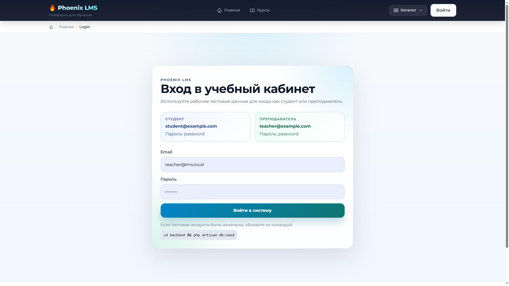
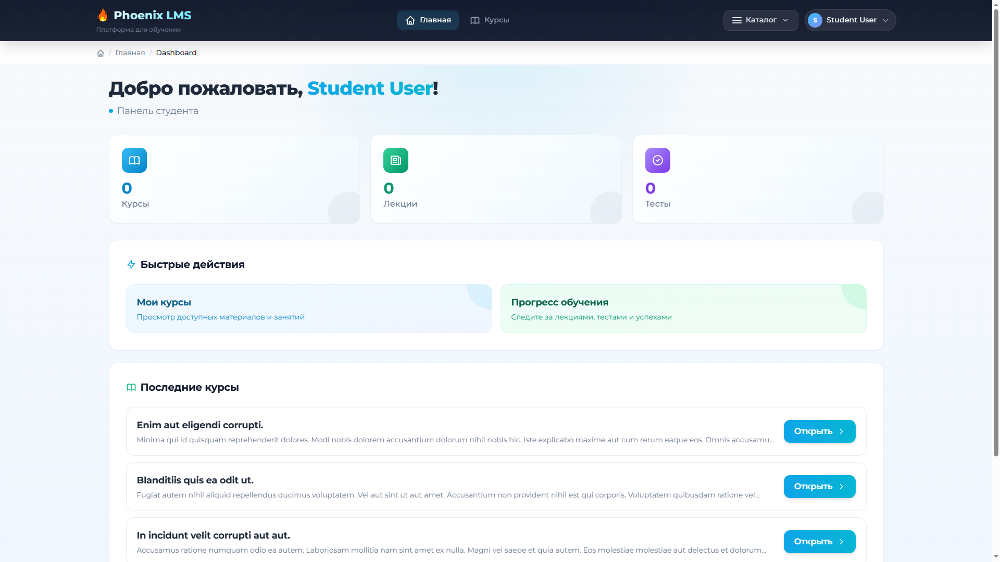
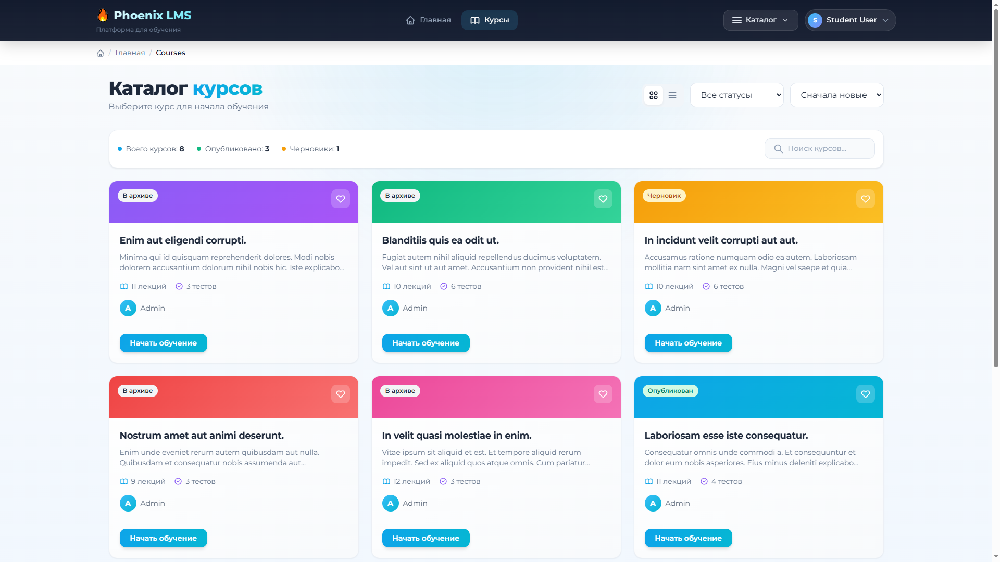
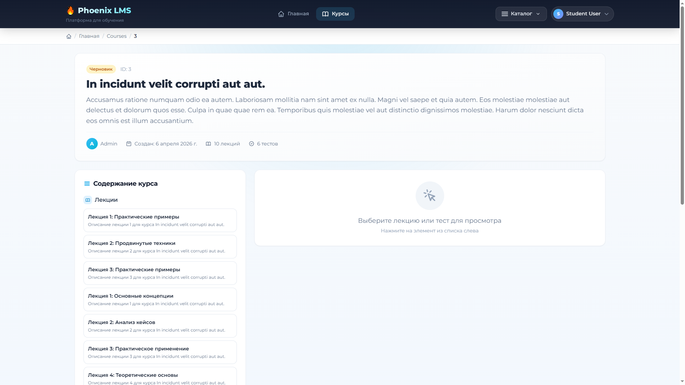
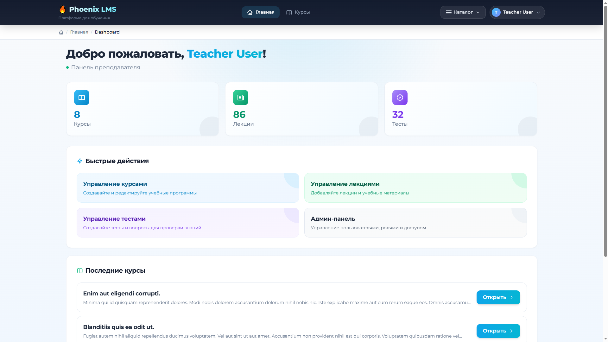
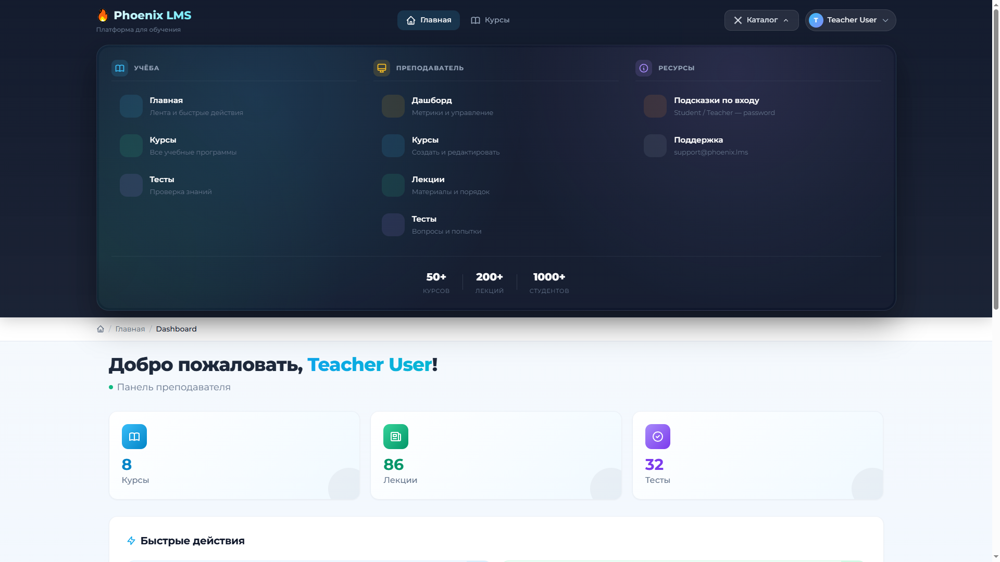

# Phoenix LMS

Phoenix LMS - учебная платформа на Laravel 11 + Vue 3 с ролями (student/teacher/admin), API на Sanctum и готовым Docker-окружением для локальной разработки.

## Что внутри
- Backend: Laravel 11, Sanctum, Spatie Permissions, PHP 8.4 (php-fpm)
- Frontend: Vue 3, Pinia, Vue Router, Vite, TailwindCSS
- Infra: Docker Compose (`nginx` + `app` + `mysql:8` + `redis`)

## Требования
- Docker Desktop (или совместимый Docker runtime)
- Свободные порты: `8080` (web), `3307` (MySQL)

## Быстрый старт

```bash
# 1) Сборка и запуск контейнеров
docker compose up --build -d

# 2) Проверка состояния
docker compose ps
```

После первого запуска приложение само:
- дождется готовности базы,
- применит миграции,
- загрузит сиды,
- подготовит кеши Laravel.

Открыть в браузере: `http://localhost:8080`

## Тестовые аккаунты

### Админка (Filament)
- `superadmin@example.com` / `password`
- `admin@example.com` / `password`
- `content@example.com` / `password`
- `usermanager@example.com` / `password`
- `rolemanager@example.com` / `password`

### Веб-приложение
- `teacher@example.com` / `password`
- `student@example.com` / `password`
- `user@example.com` / `password`
- `test@example.com` / `password`

## Полезные команды

```bash
# Перезапуск контейнеров
docker compose restart

# Логи приложения
docker compose logs -f app

# Логи веб-сервера
docker compose logs -f web

# Выполнить artisan-команду
docker compose exec app php artisan <command>

# Прогнать тесты
docker compose exec app php artisan test
```

## Разработка фронтенда (HMR)

Если нужен Vite hot reload:

```bash
docker compose exec app npm run dev -- --host 0.0.0.0 --port 5173
```

В этом режиме backend остается на `http://localhost:8080`, dev-сервер Vite обычно на `http://localhost:5173`.

## Сброс окружения

```bash
# Полный пересозданный старт (включая volume с БД)
docker compose down -v
docker compose up --build -d
```

## Структура проекта
- `docker-compose.yml` - описание Docker-окружения
- `docker/php/Dockerfile` - сборка образа PHP + Node + Composer
- `docker/php/entrypoint.sh` - автоинициализация Laravel при старте контейнера
- `backend/` - Laravel-приложение и фронтенд-ресурсы
- `backend/database/seeders/DatabaseSeeder.php` - тестовые роли, пользователи и учебные данные

## Troubleshooting
- **502 при старте**: подождите 10-30 секунд и проверьте `docker compose ps` (контейнер `app` должен быть `healthy`).
- **Ошибка БД**: выполните `docker compose down -v` и запустите заново через `docker compose up --build -d`.
- **Проблемы с ассетами**: `docker compose exec app npm run build`, затем `docker compose restart web`.
- **Кеш Laravel**: `docker compose exec app php artisan optimize:clear`.

## Скриншоты

| Страница | Описание |
|----------|----------|
|  | Страница входа с демо-аккаунтами |
|  | Дашборд студента со статистикой |
|  | Каталог курсов с фильтрами |
|  | Просмотр курса с лекциями |
|  | Панель преподавателя |
|  | Мега-меню навигации |
